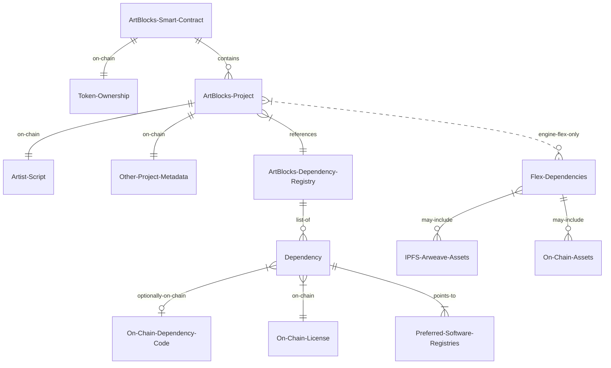

# NFT Metadata Storage at Art Blocks

An overview of NFT metadata storage philosophy and implementations at Art Blocks.

## Summary

Art Blocks tokens store their metadata fully on-chain, ensuring collectors that their NFTs will always remain accessible and immutable.

For projects that require dependencies (e.g. p5js), Art Blocks provides the [Art Blocks Dependency Registry](https://github.com/ArtBlocks/artblocks-contracts/blob/main/packages/contracts/README.md#dependencyregistry), a fully on-chain software registry that can be used to optionally store dependency releases on-chain, as well as reference preferred software storage networks.

Art Blocks Engine Flex NFTs also provide the option to store metadata on decentralized storage networks, such as IPFS or Arweave, to enable larger sized assets to be used when generating outputs.

## Overview of NFT Metadata Storage Options

While all NFTs track token ownership on a blockchain, the metadata for the NFT (image or audio information, artist information, etc.) may be stored in a variety of ways. Common options include:

| Storage Type                                                    | Immutable | Decentralized | Guaranteed to Persist Forever [^1] | Cost   |
| --------------------------------------------------------------- | --------- | ------------- | ---------------------------------- | ------ |
| [Servers/Hosting](#servershosting)                              | No        | No            | No                                 | Low    |
| [Hash On-Chain](#hash-on-chain)                                 | Yes       | No            | No                                 | Low    |
| [Decentralized Storage Network](#decentralized-storage-network) | Yes       | Yes           | No [^2]                            | Medium |
| [Fully On-Chain](#fully-on-chain)                               | Yes       | Yes           | Yes                                | High   |
| [Software Registry](#software-registries)                       | ~No       | ~Yes          | No, Very Low Risk                  | Low    |

[^1]: As long as the blockchain network continues to exist.
[^2]: Requires ≥1 interested party

### Servers/Hosting

The metadata are stored on a server or cloud hosting service, such as AWS. This is a convenient and cheap option, but it has a few drawbacks:

- The metadata can be changed by the server owner, so the NFT is not immutable.
- The metadata can be lost if the server goes down or an admin decides not to discontinue paying for the service.
- The metadata can be censored by the server owner.

### Hash On-Chain

The hash of the metadata is stored on-chain, and the metadata are stored on a server. Storing the hash of the metadata makes the NFT immutable, while keeping it much cheaper than storing all of the metadata on-chain. However, it has a few drawbacks:

- The metadata can be lost if the server goes down or an admin decides not to discontinue paying for the service.
- The metadata can be censored by the server owner.

Projects such as CryptoPunks originally stored the hash of the metadata on-chain, but the metadata were stored on a server. They have since upgraded to a fully on-chain solution.

### Decentralized Storage Network

The metadata are stored on a decentralized storage network, such as IPFS or Arweave. This is a popular option, and enables the NFT to be immutable. Drawbacks include:

- The metadata must remain pinned by at least one party in order to be accessible.

### Fully On-Chain

The metadata are stored on the blockchain. This is the most expensive option, but it has many advantages. The metadata are always accessible and available, as long as the NFT exists. Collectors and artists never have to worry about a token's outputs disappearing.

### Software Registries

Some NFTs (like some Art Blocks project tokens) may rely on published software libraries when generating outputs. In these cases, the NFT metadata may include information about dependencies and where to find them (e.g. "p5js, v1.0.0 on the npm software registry"). Software registries are a special form of decentralized storage, because of the distributed nature of the software repositories and many downloads on developers' computers worldwide.

## Art Blocks Storage Solutions

### Art Blocks Fully On-Chain

Art Blocks Flagship and Art Blocks Engine NFTs only rely on fully on-chain storage solutions, plus allowing a single dependency to be housed on a software registry. This provides an extremely high level of confidence that the NFTs will remain fully accessible and immutable for the foreseeable future.

While Art Blocks originally relied on the npm software registry to house dependencies, the Art Blocks team has since created a **fully on-chain software registry called the [Art Blocks Dependency Registry](https://github.com/ArtBlocks/artblocks-contracts/blob/main/packages/contracts/README.md#dependencyregistry)**. The registry is fully decentralized and is used by all Art Blocks Flagship NFTs. The registry enables dependencies to be stored fully on-chain, when the gas costs are justified. Art Blocks uploaded their first dependency, p5js v1.0.0, to the registry in January 2024, retiring any doubt that projects relying on p5js@1.0.0 would ever be unable to generate their outputs in the future.

### Engine Flex

Art Blocks Engine Flex NFTs provide an additional option for storing metadata. Flex NFTs can store metadata on-chain, or they can store the metadata immutably on the IPFS or Arweave decentralized storage networks. This allows Flex NFTs to utilize larger sized assets when generating outputs, while still providing the option for fully on-chain metadata where possible.

## Examples

## On-Chain Script Example

Let's review an example of how to retrieve the token and script metadata for the first Art Blocks Token, token zero of project 0, [Chromie Squiggle by Snowfro](https://www.artblocks.io/collections/curated/projects/0x059edd72cd353df5106d2b9cc5ab83a52287ac3a/0).

> Note: Newer versions of Art Blocks core contracts have different function names than the V0 Art Blocks core contract shown in this example.

While we could query the Art Blocks Subgraph or API to retrieve the metadata, we will retrieve the metadata directly from the blockchain.

1. Visit the original Art Blocks Core Contract on Etherscan: [0x059EDD72Cd353dF5106D2B9cC5ab83a52287aC3a](https://etherscan.io/address/0x059EDD72Cd353dF5106D2B9cC5ab83a52287aC3a#readContract)
2. Get project 0's metadata by calling the `projectDetails` function with the project ID as the input parameter:

3. Get project 0's script details by calling the `projectScriptInfo` function with the project ID as the input parameter:

4. Get the script javascript by calling the `projectScriptByIndex` function with the project ID and index 0 as the input parameter. The returned text is the javascript code that is used to generate Chromie Squiggles!

5. Get token 0's token hash by calling the `showTokenHashes` function with the token ID as the input parameter. This is the hash that is injected into the script to generate the token's unique output.

## On-Chain Dependency Example

Let's review an example of how to retrieve the dependency metadata for the first Art Blocks Token, token zero of project 0, [Chromie Squiggle by Snowfro](https://www.artblocks.io/collections/curated/projects/0x059edd72cd353df5106d2b9cc5ab83a52287ac3a/0).

In this case, the project uses the p5js v1.0.0 dependency, which is stored fully on-chain via the Art Blocks Dependency Registry. While we could query the Art Blocks Subgraph or API to retrieve the metadata, we will retrieve the metadata directly from the blockchain.

1. Visit the Art Blocks Dependency Registry on Etherscan: [0x37861f95882ACDba2cCD84F5bFc4598e2ECDDdAF](https://etherscan.io/address/0x37861f95882ACDba2cCD84F5bFc4598e2ECDDdAF#readProxyContract)

2. Get the dependency details by calling the `getDependencyDetails` function with the dependency name and version as the input parameters. At this time, we translate from the string `p5@1.0.0` to its bytes representation `0x703540312e302e30`:

3. Get the dependency code by calling the `getDependencyScript` function with the dependency name and version as the input parameters. We again translate to the bytes representation `0x703540312e302e30`, and can increment the index to get all 10 chunks of the dependency code:

And that's it! We now have all of the information we need to generate the token's output, and we can be confident that the metadata will always be available and immutable!

> Note: At this time, dependency scripts are stored compressed via gzip on-chain. Updates are planned to store code that can unzip the dependencies.
