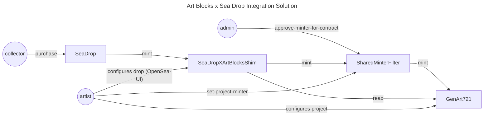

# SeaDrop Integration

This page provides an overview of an integration solution for the Art Blocks Shared Minter Suite with OpenSea's SeaDrop system. This is a special integration that allows Art Blocks projects to be minted and sold on OpenSea via SeaDrop, and is not a standard integration with the Shared Minter Suite.

The integration requires a few non-standard steps to ensure that the SeaDrop contract can interact with the minter suite. The steps below outline the process for integrating SeaDrop with the Art Blocks Shared Minter Suite.

---

## Integration Process

The integration process follows the custom, one-off minter steps, and supports minting on any project that uses the Shared Minter Suite.

### 1. Artist configures their project

The artist configures their project as they normally would, using the [Art Blocks Creator Dashboard](https://create.artblocks.io).

The only exception is that the artist does not need to configure the minter for their project, as the minter will be configured separately as described in the following steps.

### 2. Deploy `SeaDropXArtBlocksShim` Contract

The `SeaDropXArtBlocksShim` contract is a custom contract that allows the SeaDrop contract to interact with the Shared Minter Suite. This contract must be deployed for each project that will be integrated with SeaDrop, in order to satisfy a 1:1 mapping between the shim contract and the project.

Deployment of the `SeaDropXArtBlocksShim` contract is a one-time process for each project, and may be deployed by anyone. Deployment of the shim contract requires the following parameters:

```solidity
constructor(
        IMinterFilterV1 minterFilter_,
        ISeaDrop allowedSeaDrop_,
        IGenArt721CoreContractV3_Base genArt721Core_,
        uint256 projectId_
)
```

> Note: The `allowedSeaDrop_` parameter should be set to the address of the SeaDrop contract that will be used for the project, defined by OpenSea here: https://github.com/ProjectOpenSea/seadrop/blob/main/README.md#deployments

### 3. Admin approve minter for contract

Following the custom, one-off minter steps, the admin must approve the minter for the project's core contract.

Engine Admin calls `approveMinterForContract` on the shared minter filter contract (via e.g. etherscan or gnosis safe tx builder), passing in the address of their core contract, and the `SeaDropXArtBlocksShim` custom minter contract

### 3. Artist configures the custom minter for their project

Following the custom, one-off minter steps, the artist will need to configure the custom minter for their project. The artist will need to configure the custom minter via etherscan, etc. Note that the typical minter filter function for setting a minter for a project, `setMinterForProject` should be used by the artist or admin to assign the custom minter for the project.

### 4. Artist configures their drop on OpenSea's Studio

The artist will need to configure their drop on OpenSea's Studio.

A general guide for configuring a drop on OpenSea Studio is published by OpenSea here: https://docs.opensea.io/docs/part-2-edit-collection-settings

In OpenSea Studio, the artist should see a new contract available to edit, which will be the `SeaDropXArtBlocksShim` contract. The artist should configure the drop as they normally would, using the OpenSea Studio interface.

A few options that don't make sense for Art Blocks projects, such as IPFS metadata (Art Blocks projects are on-chain), should be left blank.

If SeaDrop is configured to sell less tokens than the project's max invocations, minting on OpenSea will be limited to whatever is configured in SeaDrop.

!!!warning
Important: The artist must set their primary sales payment address on OpenSea Studio in a manner that properly splits the payment between the artist and the platform and/or render provider. A manually created splitter contract (e.g. using 0xSplits) may be an appropriate solution. Secondary sales will be handled automatically by the Art Blocks Core contract, but primary sales **must** be configured correctly in SeaDrop by the artist.
!!!

### 5. Notify OpenSea of the integration

The artist should notify Art Blocks and OpenSea of the integration, so that the OpenSea team can ensure that the integration is properly displayed on their website. The shim contract must be properly configured to point to the correct project ID for items to intuitively show up in the OpenSea UI.

### 6. Enjoy!

Your Art Blocks tokens are now available for sale on OpenSea via SeaDrop!

---

## Shim Contract Details

The diagram below illustrates the relationship between different entities and the `SeaDropXArtBlocksShim` contract, the Shared Minter Suite, and the SeaDrop contract.


